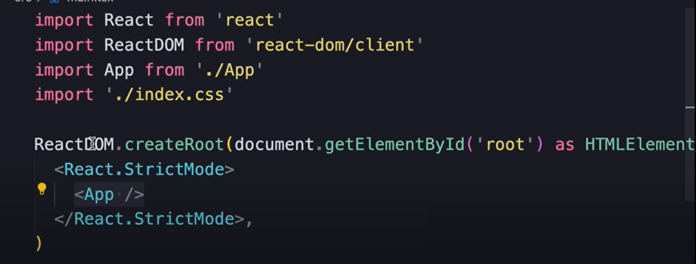
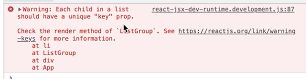

# Getting Started with React

## Setting up the development Environment
### Check Version of NodeJs in your machine:
`node -v`

### If you dont have Node
You can install by `sudo apt install nodejs` or head up to [](nodejs.org)

### Highly suggested that you use VScode
Advised to use the prettier extension for code refactoring
**setup Prettier** Go to `Preference` > `settings` > `Format on save`

## Creating a react app
### 1. Using Vite (*much faster & gives us smaller bundle sizes*)
`npm create vite@latest` or specify version `npm create vite@4.1.0`
Specificy framework react, language (typescript), then `cd "project name"`, `npm i` to install all third party libraries, `code .` to open the folder, `npm run dev` to run our webserver <br>
under the hood, Vite managed the changes in real time via `hmr`


### 2. Using Create React APP (CRA) *tool by the official react team, but painful to setup with alot of third-party apps*

### 3. Meta Frameworks *(NEXT.js)*


### 4. Simply use [stackblitz](https://stackblitz.io) and cut all the bs


## Project structure (*with vite*)
>**REACT-APP (folder)**
>>**Node Modules**: Where third party libraries and other tools are installed (less likely you ever have to touch it) <br>
>>**Public**: All public assets of the app resides here <br>
>>**src**: Source code of our app
>>>***main.tsx**: It uses ReactDOM to render the component tree inside an element with id of `root`
>>>***App***: The app component 
>>***index.html:*** Contains a div with id `root`, a container for our application. <br>
>>***package.json:*** Information about this project (name, version, scripts, list of dependencies)<br>
>>***tsconfig.json:*** Telling the ts compiler on how to compile our TS into JS (less likely you gonna ever need to touch it)<br>


## How React Works
Currently the `root` is **App** and the **Message** being the child
When react starts it takes the componet tree and build a JS data structure - The **VirtualDOM** <br>
**VirtualDOM:** Is the lightweight in-memory representation of the component tree, where each **node** represents a component and its properties <br>
When a componet changes react updates the corresponding **Node** in the component tree to reflect the new state 
The DOM is updated by the **ReactDOM** compiling library
Inside **main.tsx** we use ReactDOM to render this component tree, inside an element with an id of `root`

### React is platform-agnostic
This means it can use to build UIs that are not tied to a specific platform, this is because:
- **Separation of logic and Rendering:** React strictly focues of the structure of the UI while the rendering is handles by different libraries
- **Multiple renderes (libraries):** **ReactDOM**  for web apps, **React Native** for iOS and Android, etc
- **Platfrom-specif APIs:** Allow use of platform-specific APIs while core logic can be shared

## Creating a react component
In **src** file add  a file with "componetName".tsx naming

### 1. With a JavaScript class *(older projects)*
### 2. With a function *(more popular since they are concise and easy to understand)*
``` 
function Message(){
    return <h1>Hellow word</h1>
} 
export default Message 
// To use a component, we first to export it as a default object for this module
```
The above sysntax is JSX: (JavaScript XML), Visting [babeljs.io](https://babeljs.io/repl) to see how JSX to JS converstion is done

Below is a sample usage of the exported component
```
import Message from './Message';

function App(){
    return <div></Message></div>
}

export default App

```
JSX allow us to easilt create dymanic content; Within `{}` we can write any pieace of code that return a value, whether a variable or a function e.g `<h1> Hi {getName()} </h1>` or `<h1> hi {name}</h1>`
```
function Message(){
    const name = 'ignasxv';
    return <h1>Hello {name} </h1>
}
```

## Creating a ListGroup Component
### Installing bootstrap
- `npm i bootstrap@5.2.3` or any other version
- You can get rid of ***App.css** and **index.css**
- In Main.tsx, replace `./index.css` with `bootstrap/dist/css/bootstrap.css`
- Done: You should now notice app changes in teh browser

### In `src` folder add a `components` folder
- with component create `ListGroup.tsx` - component
-  Create your List group as a fx and export it
- Copy paste the correposing class from bootstrap 
- remember to change `class` to `className` since `class` is a reserved keyword
- If you are returning multiple elements wrap them in fragments `<> </>` (wrap with abv)

### Rendering Lists dynamically
- declare a list `const items = ['a', 'b'];
- Can't use a for loop; so we use `map` function 
- so: `items.map(item => <li>{item}</li>)`, remember to wrap in `{}`
- 
- To give each child unique key: `items.map(item => <li key={item}>{item}</li>)`, remember to wrap in `{}`

### Conditional Rendering
- ` {condition ? <p>Condition True</p> : null}` 
